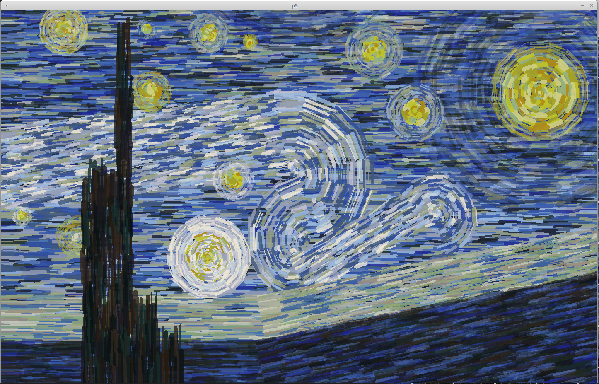

# vincent

P5 Drawing Extension - Post-impressionist functions (coding challenge)
Running sketch.py with no argument draws a semblance of 'Starry Night' from Vincent Van Gogh.

## Functions available
vincent.py implements the following:
### **draw_filled_arc()**
Draws an arc of strokes (See strokes).  
If the min_radius is not provided, it will draw a filled circle, otherwise more like a rainbow.

Parameters:
  - **center_coord** - (x,y) tuple indicating the starting point.
  - **painting_stroke** - see the painting stroke class.  
  It's really just a length, stroke weight and an array of colors to pick.
  - **max_radius** - max radius of the arc (most distance from the center coordinates)
  - **gap_x** (= 2), **gap_y** (= 1) - (float) factor increasing/decreasing the gaps between the strokes.  
  Remember that wobble and length variation will also add some gaps.
  - **alpha** (= 0.5) - alpha value to use for the lines.
  - **min_radius** (= 1) - min radius of the arc.  
  When not provided, it will draw strokes down to the center coordinates.
  - **starting_angle** (= 0), **ending_angle** (= TWO_PI) - Says on the tin, try it out...  
  Make sure the starting angle is less than the ending angle. 
  - **angle_increment** (= PI/8) - the amount by which each segment turns.  
  Using PI/8 will give each quarter of circle about 4 strokes/segments.

### **draw_directional_lines()**
Draws a rectangle of strokes (See strokes).

Parameters:
  - **starting_coord** - (x,y) tuple indicating the starting point.  
  Given the standard axis of P5, this corresponds to the top-left corner (pre-rotation)
  - **painting_stroke** - see the painting stroke class.  
  It's really just a length, stroke weight and an array of colors to pick.
  - **width**, **height** - width and height of the rectangle to cover.  
  Note that the right-most of the rectangle will have a rather jagged edge.
  - **angle** (= 0) - angle to rotate the rectangle by around the starting coordinate.  
  Default to no rotation.
  - **gap_x** (= 0), **gap_y** (= 1) - (float) factor increasing/decreasing the gaps between the strokes.  
  Remember that wobble and length variation will also add some gaps. 
  - **alpha** (= 0.5) - alpha value to use for the lines.

## Strokes
All strokes drawn have an x-axis and y-axis wobble.  
Currently, the random range is hard-coded in the functions.

All strokes also have a randomised length, also hard coded.

The strokes randomly picks a color from the array of colors defined by the PaintingStroke.  
In the sketch sample, I used multipliers to increase the chance for specific colors to be picked.

## Yeah, I know...
I just wanted to see if the wobble, and randomising color could look like post-impressionism.  
With more efforts, maybe...

Silver lining is you get a Readme file.
